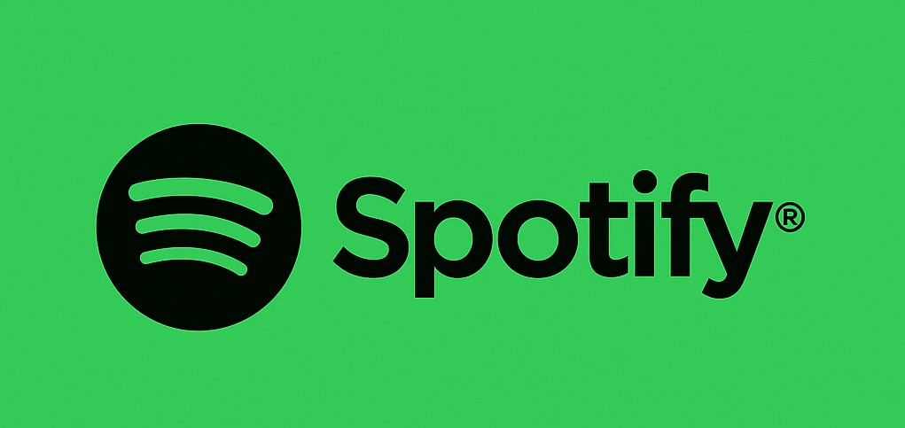

<!-- BANNER -->
<p align="center">
  
</p> 


<h1 align="center">⚡Next-Music 스포티파이 플레이리스트</h1>
<p align="center">
  <b>Next.js + TypeScript 기반의 인터렉티브 스포티파이 플레이리스트</b>
</p>

<p align="center">
  <a href="https://poke-next-amber.vercel.app">
    
  </a>
  <a href="https://github.com/choidy180/poke-next">
    
  </a>
  
  
  
</p>

---

##  기능
- 🔍 **검색 가능한 포켓몬 도감** (이름·번호로 검색)
-  **상세 정보 제공**: 스탯, 타입, 이미지 등
- 🎨 **반응형 디자인**
-  **빠른 로딩 및 화면 전환** (Next.js의 ISR/SSG 활용)
-  **직관적인 UI 구성** (카드형 리스트, 모달, 탭 등)

---

##  기술 스택
<p align="center">
  
  
  
  
  
  
</p>

---

##  라이브 데모
-  URL: 현재 미배포
-  Next.js + Vercel 환경에서 배포 중

---

##  프로젝트 요약
#### 1. NextJS + 스타일컴포넌트 사용
#### 2. 스포티파이 API 사용하여, 기존 등록한 플레이리스트 불러오기
#### 3. 음악재생시 관련 MV & VIDEO 배경으로 전환표시


##  Install
```bash
# 1) 레포지토리 복제
git clone https://github.com/choidy180/next_music.git
cd poke-next

# 2) 의존성 설치
npm install

# 3) 개발 서버 실행
npm run dev
# 브라우저에서 http://localhost:3000, http://127.0.0.1:3000 열기
```

## 📡 Example Fetch (Import Spotify Playlist)
```bash

'use client';

import { useSearchParams } from 'next/navigation';
import { useEffect, useState, useRef } from 'react';
import styled, { css } from 'styled-components';

interface Playlist {
  id: string;
  name: string;
  description: string;
  image: string;
}

interface Track {
  id: string;
  name: string;
  artists: string;
  image: string;
  previewUrl: string;
}

export default function AccessiblePlaylists() {
  const searchParams = useSearchParams();
  const accessToken = searchParams.get('access_token');

  const [playlists, setPlaylists] = useState<Playlist[]>([]);
  const [tracks, setTracks] = useState<Track[]>([]);
  const [selectedPlaylist, setSelectedPlaylist] = useState<string | null>(null);
  const [error, setError] = useState<string | null>(null);
  const [loading, setLoading] = useState(true);
  const [playingTrackId, setPlayingTrackId] = useState<string | null>(null);
  const audioRef = useRef<HTMLAudioElement | null>(null);
  const [bgImage, setBgImage] = useState('/iu/iu-lee-ji-eun-uhdpaper.com-4K-8.3014.jpg'); // 초기 배경

  const handlePlayPause = (track: Track) => {
    if (!track.previewUrl) return;

    if (audioRef.current?.src !== track.previewUrl) {
      audioRef.current!.src = track.previewUrl;
      audioRef.current!.play();
      setPlayingTrackId(track.id);
    } else {
      if (audioRef.current!.paused) {
        audioRef.current!.play();
        setPlayingTrackId(track.id);
      } else {
        audioRef.current!.pause();
        setPlayingTrackId(null);
      }
    }
  };

  useEffect(() => {
    if (!accessToken) {
      setError('Access token이 없습니다.');
      setLoading(false);
      return;
    }

    const fetchAccessiblePlaylists = async () => {
      try {
        const res = await fetch(
          'https://api.spotify.com/v1/me/playlists?limit=20',
          {
            headers: {
              Authorization: `Bearer ${accessToken.trim()}`,
            },
          }
        );

        if (!res.ok) {
          const errorText = await res.text();
          throw new Error(`status ${res.status}: ${errorText}`);
        }

        const data = await res.json();

        const list: Playlist[] = data.items.map((item: any) => ({
          id: item.id,
          name: item.name,
          description: item.description,
          image: item.images[0]?.url ?? '',
        }));

        setPlaylists(list);
        setLoading(false);
      } catch (err: any) {
        setError(`플레이리스트를 가져오지 못했습니다: ${err.message}`);
        setLoading(false);
      }
    };

    fetchAccessiblePlaylists();
  }, [accessToken]);

  const fetchTracks = async (playlistId: string) => {
    if (!accessToken) return;
    try {
      const res = await fetch(
        `https://api.spotify.com/v1/playlists/${playlistId}/tracks?market=from_token&limit=10`,
        {
          headers: {
            Authorization: `Bearer ${accessToken.trim()}`,
          },
        }
      );
      if (!res.ok) {
        const errorText = await res.text();
        throw new Error(`status ${res.status}: ${errorText}`);
      }
      const data = await res.json();
      const trackList: Track[] = data.items.map((item: any) => ({
        id: item.track.id,
        name: item.track.name,
        artists: item.track.artists.map((artist: any) => artist.name).join(', '),
        image: item.track.album.images[0]?.url ?? '',
        previewUrl: item.track.preview_url ?? '',
      }));
      setTracks(trackList);
      setSelectedPlaylist(playlistId);
    } catch (err: any) {
      setError(`트랙을 불러오지 못했습니다: ${err.message}`);
    }
  };

  if (loading) return <div style={{ padding: '1rem' }}>로딩 중...</div>;
  if (error) return <div style={{ padding: '1rem', color: 'red' }}>{error}</div>;

  return (
    <Wrapper>
      <Background $bg={bgImage} />
      <audio ref={audioRef} hidden />
      <SectionTitle className='mt'>🎵 플레이 리스트</SectionTitle>
      <PlaylistGrid>
        {playlists.map((playlist) => (
          <Card key={playlist.id} onClick={() => fetchTracks(playlist.id)}>
            <TrackBackground $bg={`${playlist.image}`}/>
            <Thumbnail src={playlist.image} alt={playlist.name} />
            <Title>{playlist.name}</Title>
            <Description>{playlist.description}</Description>
            <IdText>ID: {playlist.id}</IdText>
          </Card>
        ))}
      </PlaylistGrid>

      {selectedPlaylist && (
        <div>
          <SectionTitle>🎵 트랙 목록</SectionTitle>
          <Carousel>
            {tracks.map((track) => (
              <StyledTrackCard
                key={track.id}
                $active={playingTrackId === track.id}
                onClick={() => setBgImage(track.image)}
              >
                <TrackBackground $bg={`${track.image}`}/>
                <FixedBox>
                  <Thumbnail src={track.image} alt={track.name} />
                  <Title>{track.name}</Title>
                  <Description>{track.artists}</Description>
                  {track.previewUrl && (
                    <PlayButton onClick={() => handlePlayPause(track)}>
                      {playingTrackId === track.id ? '⏸ 일시정지' : '▶ 재생'}
                    </PlayButton>
                  )}
                </FixedBox>
              </StyledTrackCard>
            ))}
          </Carousel>
        </div>
      )}
    </Wrapper>
  );
}

const Wrapper = styled.div`
  padding: 1rem;
`;

const Background = styled.div<{ $bg: string }>`
  position: absolute;
  top: 0; left: 0;
  width: 100%;
  height: 100%;
  background-image: url(${(props) => props.$bg});
  background-size: cover;
  background-position: center;
  filter: blur(4px);
  z-index: 0;
  transition: background-image 0.5s ease-in-out;
`;

const PlaylistGrid = styled.div`
  display: grid;
  grid-template-columns: repeat(auto-fill, minmax(250px, 1fr));
  gap: 1rem;
  margin-bottom: 2rem;
`;

const Card = styled.div`
  border: 1px solid #ccc;
  border-radius: 12px;
  padding: 1rem;
  display: flex;
  flex-direction: column;
  align-items: center;
  cursor: pointer;
  transition: background 0.2s;

  &:hover {
    border: 1.4px solid white;
  }
`;

const StyledTrackCard = styled(Card).withConfig({
  shouldForwardProp: (prop) => prop !== '$active',
})<{ $active: boolean }>`
  min-width: 250px;
  max-width: 250px;
  flex: 0 0 auto;
  ${(props) =>
    props.$active &&
    css`
      border-color: #1db954;
      background-color: #eafbea;
    `}
`;

const Carousel = styled.div`
  display: flex;
  overflow-x: hidden;
  gap: 1rem;
  padding-bottom: 1rem;
  scroll-snap-type: x mandatory;
  scroll-behavior: smooth;
  -webkit-overflow-scrolling: touch;
  touch-action: pan-x;

  & > * {
    scroll-snap-align: center;
    flex-shrink: 0;
    transition: transform 0.3s ease-in-out;
  }
`;

const Thumbnail = styled.img`
  width: 100%;
  height: 160px;
  object-fit: cover;
  border-radius: 8px;
  border: 1.4px solid black;
`;

const Title = styled.h2`
  font-size: 1rem;
  font-weight: bold;
  margin-top: 0.75rem;
  text-align: center;
  text-shadow:
    -1px -1px 0 white,
     1px -1px 0 white,
    -1px  1px 0 white,
     1px  1px 0 white;
`;

const Description = styled.p`
  font-size: 0.875rem;
  color: black;
  text-align: center;
  margin-top: 0.25rem;
  text-shadow:
    -1px -1px 0 white,
     1px -1px 0 white,
    -1px  1px 0 white,
     1px  1px 0 white;
`;

const IdText = styled.code`
  font-size: 0.75rem;
  color: black;
  margin-top: 0.5rem;
  text-shadow:
    -1px -1px 0 white,
     1px -1px 0 white,
    -1px  1px 0 white,
     1px  1px 0 white;
`;

const SectionTitle = styled.h3`
  font-size: 1.25rem;
  font-weight: bold;
  margin-bottom: 1rem;
  &.mt {
    margin-top: 40vh;
  }
`;

const PlayButton = styled.button`
  margin-top: 0.5rem;
  padding: 0.5rem 1rem;
  background-color: #1db954;
  color: white;
  border: none;
  border-radius: 20px;
  cursor: pointer;
  font-weight: bold;
  transition: background-color 0.3s ease;

  &:hover {
    background-color: #1ed760;
  }
`;

const FixedBox = styled.div`
  width: 100%;
  height: 100%;
  display: flex;
  flex-direction: column;
  align-items: center;
`;

const TrackBackground = styled.div<{ $bg: string }>`
  position: absolute;
  top: 0; 
  left: 0;
  width: 100%;
  height: 100%;
  background-image: url(${(props) => props.$bg});
  background-size: cover;
  background-position: center;
  filter: brightness(1) blur(6px);
`
```
